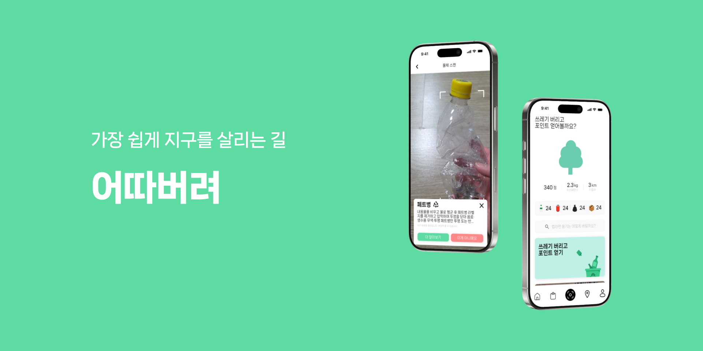
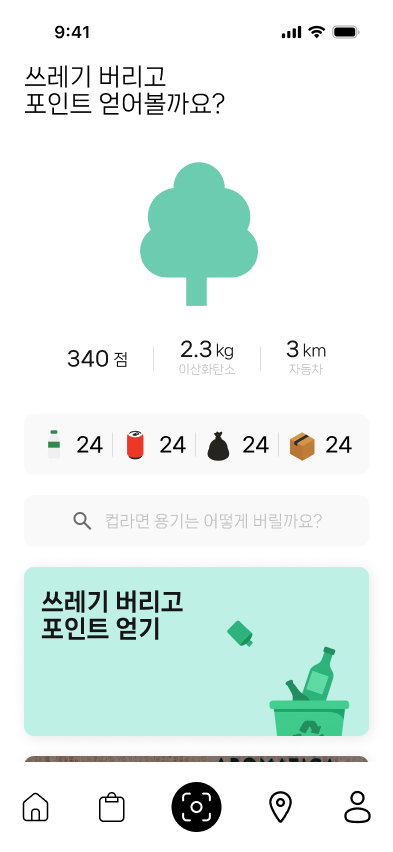
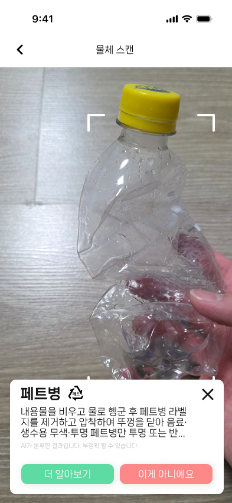
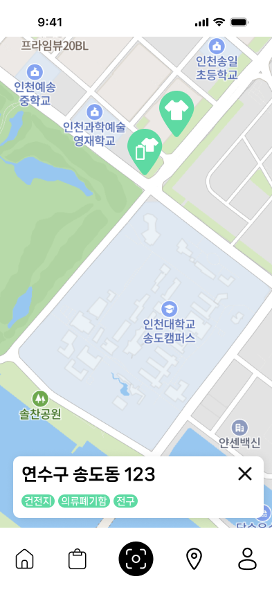
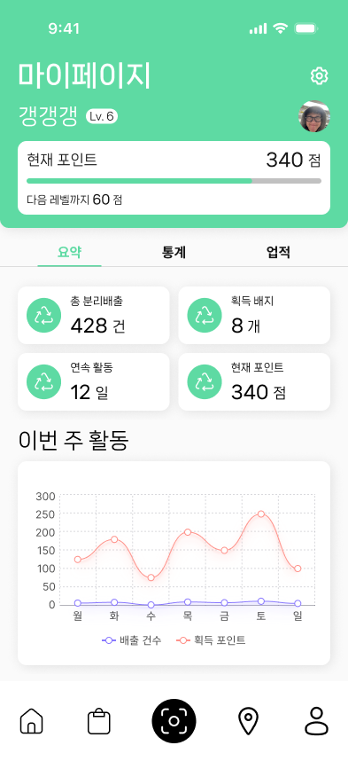

# 어따버려 앱

어따버려? 여따버려!
---



## 🚀 서비스 개요

### 서비스 정의 및 목적

'어따버려'는 사용자가 바코드 스캔 또는 이미지 인식을 통해 쓰레기의 올바른 분리수거 방법을 즉시 확인할 수 있는 **모바일 애플리케이션**입니다. 분리수거 방법에 대한 지식 부족 문제를 해결하고, 사용자의 분리수거 참여 장벽을 낮춰 궁극적으로 재활용률 향상 및 환경 보호에 기여하는 것을 목표로 합니다.

### 배경 및 필요성

한국리서치 조사에 따르면 분리배출 기준에 대한 지식 평가 평균 점수가 낮고, 많은 응답자들이 귀찮거나 시간이 오래 걸려 분리배출을 제대로 지키지 않은 경험이 있습니다. 2021년 기준 한국의 낮은 플라스틱 재활용률은 분리수거의 중요성에 대한 인식과 교육 부족에서 기인하며, '어따버려'는 이러한 문제점을 해결하고자 합니다.

-----

## ✨ 주요 기능

### 핵심 기능

  * **이미지 기반 분리수거 안내**: 사용자가 직접 사진을 찍으면 **AI가 이미지를 인식**하여 분리수거 방법을 안내합니다. 바코드가 없는 물체(예: 딸기 꼭지, 껌, 플라스틱 포장재)의 분류를 지원합니다.

### 부가 기능

  * **사용자 피드백 시스템**: 분류 결과에 대한 사용자 피드백을 수집하여 "정보가 틀렸어요" 기능을 통해 데이터 개선에 활용합니다.
  * **분리수거 통계 및 환경 영향 정보**: 사용자의 분리수거 활동 통계를 제공하고, 올바른 분리수거를 통한 환경 보호 효과를 시각화하여 보여줍니다.
  * **커뮤니티 게시판**: 사용자들이 분리수거 경험이나 노하우를 공유하고, 환경 관련 정보를 주고받을 수 있는 게시판 형태의 커뮤니티 기능을 제공합니다.
  * **환경 관련 아티클**: 환경 보호의 중요성, 최신 재활용 기술, 지속 가능한 생활 방식 등 유용한 환경 관련 아티클을 제공하여 사용자들의 환경 인식을 높이고 실천을 독려합니다.

    

-----

## 🛠️ 기술 스택

### 프론트엔드

  * **프레임워크**: React Native (Expo)
  * **UI 컴포넌트**: NativeBase
  * **상태 관리**: Tanstack Query + Zustand

### 핵심 기술 모듈

  * **카메라**: `react-native-vision-camera`
  * **객체 분류**: 커스텀 모델 (YOLOv11n 기반)
  * **LLM 분석**: Gemini API
  
-----

## ⚙️ 실행 및 배포

### 환경 설정

프로젝트를 시작하기 전에 다음 도구들이 설치되어 있는지 확인해 주세요.

  * **Node.js & npm**: JavaScript 런타임 및 패키지 관리자
  * **eas-cli**: Expo Application Services CLI (글로벌 설치 권장: `npm install -g eas-cli`)
  * **플랫폼별 SDK**:
      * **Android**: Android Studio 및 관련 SDK
      * **iOS**: Xcode 및 관련 SDK

### 실행 방법

1.  **의존성 설치**: 프로젝트 루트에서 다음 명령어를 실행하여 필요한 모든 패키지를 설치합니다.

    ```bash
    npm install
    ```

2.  **애플리케이션 실행**: 개발 모드로 애플리케이션을 실행합니다.

      * Android 기기/에뮬레이터에서 실행:
        ```bash
        npm run android
        ```
      * iOS 시뮬레이터에서 실행:
        ```bash
        npm run ios
        ```

### 배포용 빌드 방법

`eas-cli`를 이용한 빌드 프로세스는 Expo Application Services (EAS) 플랫폼을 사용합니다. 다만, prebuild 시 FrameProcessor 관련 내용이 날아가는 문제로 인해 local build로 진행, 배포만 EAS를 통해 진행합니다.

1.  **내부 테스트용 빌드 (Preview)**:

      * `--profile preview` 옵션을 사용하여 내부 테스트 및 검수용 빌드를 생성합니다.
      * 플랫폼을 명시하지 않으면 모든 플랫폼을 대상으로 빌드가 진행됩니다.

    <!-- end list -->

    ```bash
    eas build [--platform android|ios] --profile preview --local
    ```

2.  **정식 버전 배포용 빌드**:

      * 최종 사용자에게 배포될 공식 버전의 빌드를 생성합니다.

    <!-- end list -->

    ```bash
    eas build [--platform android|ios] --local
    ```

-----

## 🤖 비저닝 모델

이 애플리케이션에는 객체 탐지를 위한 비저닝 모델이 통합되어 있습니다. 모델의 상세 정보, 입출력 구조, 추론 과정 및 관련 도구 사용법은 다음 문서를 참고해 주세요.

  * [**모델 상세 README**](./model/README.md)

-----