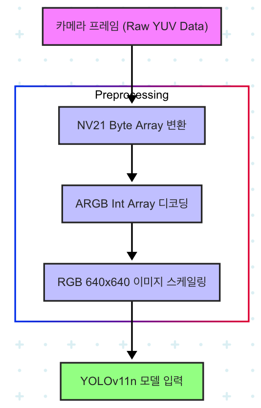

이 문서에서는 모델을 이용해 추론하기 위해 전처리 하는 과정을 설명합니다.

---

## 추론
모델 추론은 각 플랫폼의 특성에 맞춰 별도로 진행됩니다.

React Native Vision Camera는 카메라 스트림의 프레임을 **프레임 프로세서(Frame Processor)**로 전달합니다. 이때 전달되는 프레임은 YUV 픽셀 구조를 가집니다. 모델 입력이 RGB 640x640 이미지이므로, 프레임 프로세서 내에서 이 YUV 프레임을 모델이 요구하는 RGB 640x640 이미지 형식으로 변환하는 과정이 자동으로 포함됩니다. 변환된 이미지는 모델 입력으로 사용되며, 추론 결과는 다시 프레임 프로세서에서 처리됩니다.

---

## 🖼️ 이미지 전처리 과정 도식화 (안드로이드)

---

## 💡 전처리 과정 상세 설명

모델 추론을 위해서는 카메라로부터 들어오는 원시(Raw) 이미지 데이터를 모델이 요구하는 특정 형식(RGB 640x640)으로 변환하는 전처리 과정이 필수적입니다. 이 과정은 주로 **React Native Vision Camera의 프레임 프로세서** 내부에서 효율적으로 처리됩니다.

### 안드로이드

1.  **카메라 프레임 (Raw YUV Data)**
    * 모바일 기기의 카메라는 일반적으로 **YUV 형식**의 데이터를 출력합니다. YUV는 휘도(밝기, Y)와 색차(색상, UV)를 분리하여 저장하는 방식으로, RGB보다 데이터 효율이 높아 영상 처리 및 전송에 많이 사용됩니다.
    * Vision Camera의 프레임 프로세서는 이 원시 YUV 데이터를 직접 수신합니다.

2.  **NV21 Byte Array 변환**
    * 수신된 YUV 데이터는 특정 YUV 포맷인 **NV21 (`android.graphics.ImageFormat.NV21`) 형식의 Byte Array**로 변환됩니다. NV21은 YUV 데이터를 효율적으로 저장하는 일반적인 방식 중 하나입니다.
    * 이 단계는 Vision Camera 프레임 프로세서의 내부 로직에 의해 자동으로 수행됩니다.

3.  **ARGB Int Array 디코딩**
    * NV21 Byte Array로 변환된 데이터는 모델이 처리할 수 있는 일반적인 픽셀 형식, 즉 **ARGB (Alpha, Red, Green, Blue) 채널을 가진 Int Array**로 디코딩됩니다.
    * 이 과정에서 YUV 색상 정보를 RGB 색상 정보로 변환하게 됩니다. 각 픽셀은 하나의 32비트 정수(Int)로 표현되며, 이 정수 안에 ARGB 각 채널의 값이 저장됩니다.

4.  **RGB 640x640 이미지 스케일링**
    * ARGB Int Array로 디코딩된 이미지는 이제 모델 입력 규격인 **RGB 640x640 크기**로 스케일링됩니다.
    * 이 단계에서는 이미지의 해상도를 모델이 요구하는 크기로 조정하며, 패딩을 추가해 이미지가 불필요하게 변형되지 않도록 방지합니다.
    * ARGB에서 A(Alpha) 채널은 모델 입력에 필요하지 않으므로, 이 단계에서 RGB 픽셀 데이터만 추출하여 모델에 전달할 준비를 마칩니다.

5.  **YOLOv11n 모델 입력**
    * 최종적으로 RGB 640x640 크기로 변환 및 스케일링된 이미지 데이터가 YOLOv11n 모델의 입력으로 전달되어 추론이 시작됩니다.
  
### iOS
1. **iOS 프레임워크에서 다룰 수 있는 이미지 형식으로 변환**
   Vision Camera의 프레임 스펙이 갖고 있는 `CVPixelBufferRef`를 가져와 iOS 내부 CoreImage 프레임워크의 `CIImage`로 변환합니다.
3. **CoveVideo 프레임워크를 이용한 이미지 전처리**
   이제부턴 iOS 내부 CoreVIdeo 프레임워크의 여러 Affine 변환 기능들을 이용할 수 있습니다. 90도 회전 후 패딩과 스케일링을 적용합니다.
4.  **YOLOv11n 모델 입력**
    * 최종적으로 RGB 640x640 크기로 변환 및 스케일링된 이미지 데이터가 YOLOv11n 모델의 입력으로 전달되어 추론이 시작됩니다.

이러한 전처리 과정을 통해 카메라의 데이터를 모델이 이해하고 처리할 수 있는 형태로 변환하여 정확한 객체 탐지 결과를 얻을 수 있습니다.
